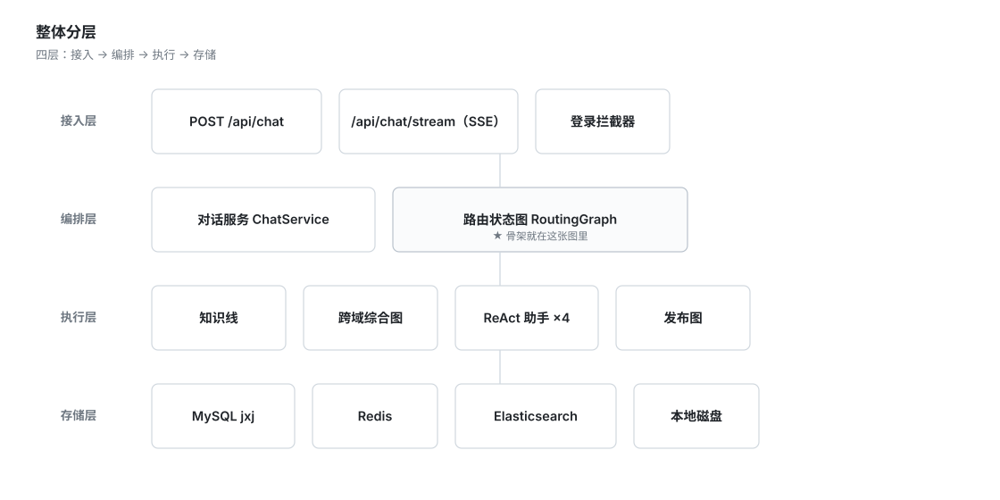
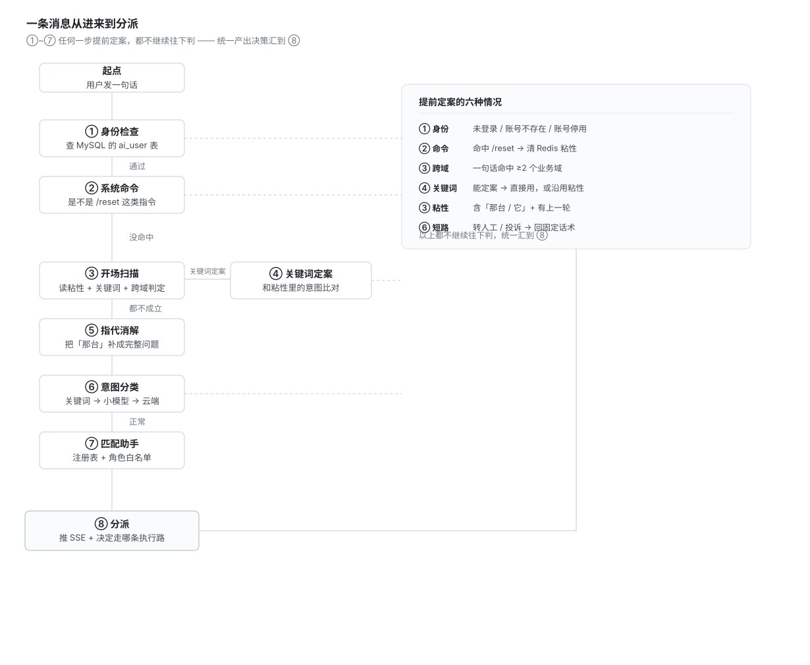
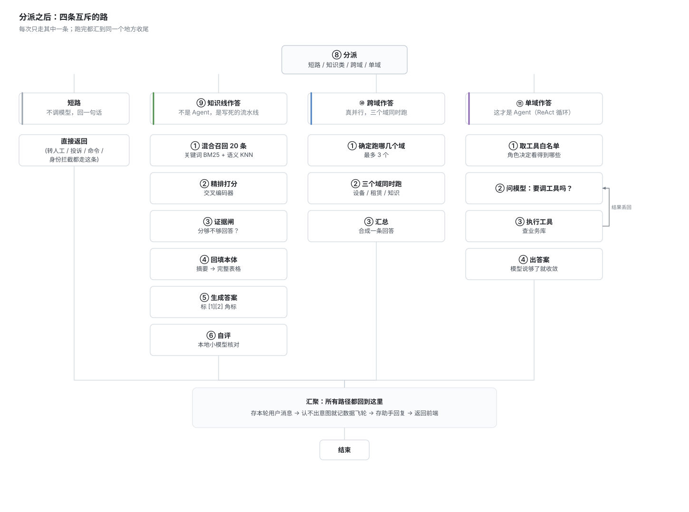

# 机械家 AI 客服 / 导购 Agent

> 一个**二手工程机械平台**的智能客服：用户可以用自然语言找设备、找出租、找活、问平台规则，
> 也能让助手代他发布出租 / 求租信息，答不上来的转人工。

**Spring Boot 4.1** · **Spring AI 2.0** · **LangGraph4j** · **MyBatis-Plus** · **Elasticsearch** · **Redis** · Java 17

---

## 它为什么不是"套壳聊天"

四条硬约束贯穿整个设计：

| 约束 | 为什么 |
|---|---|
| 规则类问题**资料不足就不许开口** | 大模型会编平台规则（编得全套、报得出费率），客服场景里这是事故 |
| 写操作**必须确定性** | 发布要落库，模型抽错字段会被校验拦下重填，绝不写半截数据 |
| **98% 的请求不产生云端费用** | 平台客服是高频场景，每句话都调大模型不现实 |
| 路由结论**可解释、可审计** | 要能回答"这句话为什么交给了这个 Agent" |

这几条约束决定了它和通用任务型 Agent 的设计取向完全不同：
**不是"给模型更多自主权"，而是"把自主权精确地切给模型该有的那部分"。**

---

## 整体架构



**四张图，按"谁来决定走向"分工** —— 这是整个项目的设计主线：

| 图 | 谁决定下一步 | 用到的 LangGraph 能力 |
|---|---|---|
| `RoutingGraph` 路由状态图 | **代码** | 条件边 ×5、dispatch 汇聚、`recursionLimit` |
| `CompositeGraph` 跨域综合图 | **代码**（决定扇出） | 隐式并行节点、appender 通道、扇入 |
| `ReactAgent` ×4 | **模型** | 预置 ReAct 循环、工具调用 |
| `PublishGraph` 发布图 | **代码** | **interrupt 挂起 + checkpointer** |

---

## 一条消息的完整数据流

### 第一段：七道判定，全部汇到 ⑧ 分派



①~⑦ 任何一步"提前定案"，都不继续往下判 —— 统一产出决策汇到 **⑧ 分派**。
**⑧ 是全图唯一的汇聚点**。

### 第二段：⑧ 之后，四条互斥的路



---

## 三个刻意的设计取舍

### ① 知识线为什么不做成 Agent

平台规则类问题（押金、费率、流程）走的是一条**代码写死的流水线**：
混合召回 → 精排 → 证据闸 → 回填本体 → 生成 → 自评。

**判据不是"这条线上有没有调模型"，而是"下一步由谁决定"。**

| | 知识线（工作流） | 如果做成 ReAct Agent |
|---|---|---|
| 能跳过检索吗 | 不能，顺序写死 | **能** |
| 能绕过证据闸吗 | 不能，闸在生成**之前** | **能** |
| 会编平台规则吗 | 不会 | **可能** |

ReAct 里的模型有自主权，**完全可能不去查资料、直接凭印象回答**，
那样证据闸就形同虚设。**防幻觉的优先级高于灵活。**

### ② 兜底 Agent 刻意不挂任何工具

它一旦能查数据，就会在路由出错时给出"看似可信其实串了领域"的答案，**掩盖真问题**。
宁可让它老实说"我帮不上忙"。

### ③ 判据选错，比阈值调错严重

证据闸最初用向量相似度做判据，阈值 0.6 实测**漏放率 100%**。
第一反应是"阈值调高一点"，但调着调着发现不对劲——**调多高都不对劲**。

标了 34 条样本画阈值曲线：

| 判据 | 有答案（中位） | 无答案（最高） | 零漏放分界 | 该分界误拦率 |
|---|---|---|---|---|
| 向量最高相似度 | 0.829 | 0.829 | 0.830 | **54%** |
| **精排分（喂标题+正文）** | **0.837** | 0.190 | **0.191** | **13%** |

**两类区间几乎完全重叠——根本不存在可用的分界点。**

根因不是阈值，是判据：向量相似度是**双塔**（问题和资料各自算好再比，两者没有交互），
对"资料里到底有没有回答这个问题"**不敏感**。**适合排序，不适合判定。**

换成**交叉编码器精排**后，漏放率 **100% → 0%**。

---

## 跑起来

### 依赖服务

| 服务 | 地址 | 说明 |
|---|---|---|
| MySQL | 127.0.0.1:3306，库 `jxj` | 业务库（只读）+ `ai_` 表（可读写） |
| Redis | 127.0.0.1:6379 | 登录令牌 + 会话粘性 |
| Ollama | 127.0.0.1:11434，模型 `qwen2.5:7b` | 意图分类第 2 层、答案自评 |
| Elasticsearch | 127.0.0.1:9200 | 知识库检索（BM25 + KNN） |

### 配置

复制 `.env.example` 为 `.env`，填上模型服务的 key（主模型 + embedding）。

### 建表

```bash
mysql -h127.0.0.1 -uroot -p jxj < src/main/resources/db/migration/V1__init_ai_tables.sql
# ... 依次执行到 V5__graph_checkpoint.sql
```

> ⚠️ `db/migration/` 下的脚本**不是 Flyway 管理的**，需要手工按顺序执行。

### 启动与测试

```bash
mvn spring-boot:run     # 聊天页 http://localhost:8082/

mvn test                # 全量测试
mvn test -Dtest=IntentEvalTest -Deval.enabled=true      # 意图识别准确率评估
mvn test -Dtest=RetrievalEvalTest -Deval.enabled=true   # 检索召回 + 证据闸阈值校准
```

---

## 量化指标

| 指标 | 数值 | 怎么来的 |
|---|---|---|
| 意图识别准确率 | **96.8%**（61/63） | 63 条人工标注评估集，含对照组 |
| 关键词层直出 | 40% | 零成本、毫秒级 |
| 本地小模型判定 | 59% | Ollama，免费 |
| 云端大模型 | **2%** | **98% 的请求不产生云端费用** |
| 检索 Recall@5 | 线上口径 **83.3%** | 24 条标注 + 10 条负样本 |
| 证据闸漏放率 | 向量判据 **100%** → 精排判据 **0%** | 34 条标注样本画曲线 |
| 文档解析 | 15 页全扫描件 **83 秒** | 并行 OCR |
| 自动化测试 | **178 个** | — |

---

## 文档

| 文档 | 内容 |
|---|---|
| [架构图.md](docs/架构图.md) | 骨架的图形版（Mermaid + 脚本生成的 SVG） |
| [简历与面试-主文档.md](docs/简历与面试-主文档.md) | 项目全貌：架构、数据流、技术亮点、量化指标、高频问答 |
| [RAG迭代与优化-面试用.md](docs/RAG迭代与优化-面试用.md) | RAG 这条线的逐代优化记录 |
| [踩坑记录与量化数据.md](docs/踩坑记录与量化数据.md) | 56 条真实踩过的坑，每条含现象 / 排查 / 根因 / 修法 |
| [开发交接.md](docs/开发交接.md) | 工程交接：环境、账号、已定决策、怎么跑 |

---

## 已知边界（照实写）

- **没有 NLI 逐句校验** —— 答案的引用角标只保证"编号合法"，不保证"标得对"
- **关键词路只搜正文** —— 而知识库 16/22 篇的标题才是问句，正在修
- **证据闸阈值未随语料重新校准** —— 语料变大后精排分布右移，当前漏放 10%
- **转人工没有真的入队** —— `ai_handoff` 表建好了，但目前只是一句固定话术
- **没有上下文压缩与长期记忆** —— 单轮短、状态外置，客服场景够用
