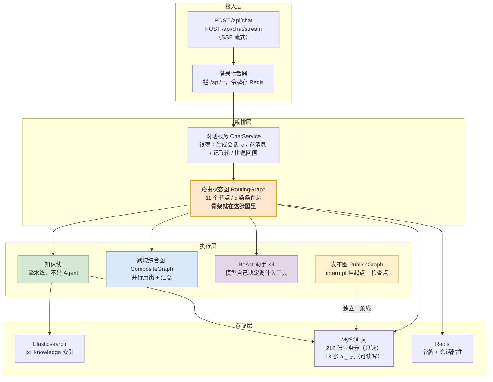
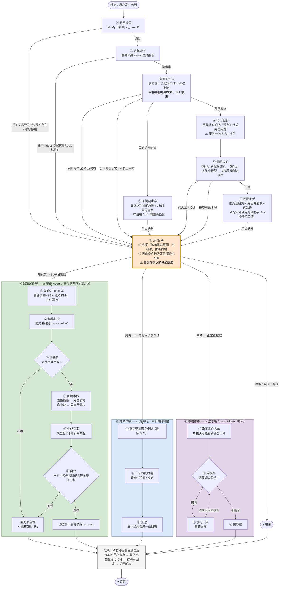
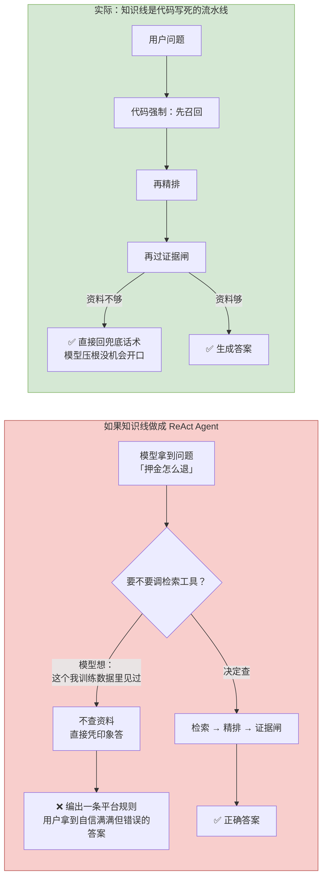
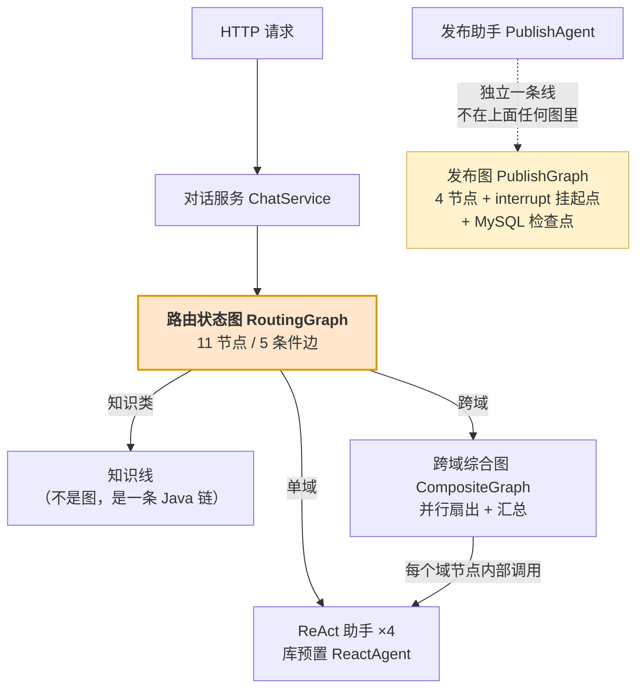
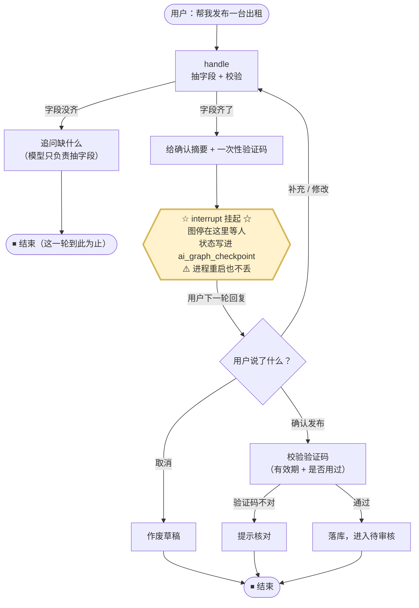
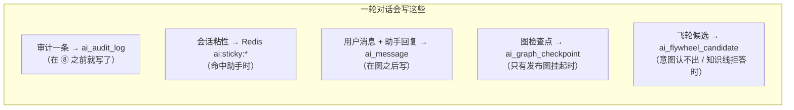

# 机械家 AI 客服 —— 架构与流程图

> **这份文档只干一件事：把项目骨架画出来。**
> 全部用 [Mermaid](https://mermaid.js.org/) 写，IDEA / VS Code / GitHub 的 markdown 预览能直接渲染成图形。
> 想要双击就看的版本：`docs/架构图.html`（自包含，断网也能开）。
>
> 最后更新：2026-09-13

---

## 〇、先看这张：整体分层



---

## 一、主流程图：一条消息从进来到返回

> **读法**：①~⑦ 全是**判定**，所有判定最终都汇到 **⑧ 分派**；
> ⑧ 之后才分岔成四条执行路。**⑧ 是整个图唯一的汇聚点。**



---

## 二、为什么知识线不做成 Agent

这是整个项目里最值得讲的一个设计判断。两张图对比：



**判据不是"这条线上有没有调模型"，而是"下一步由谁决定"。**

| | 知识线（工作流） | 如果做成 ReAct Agent |
|---|---|---|
| 能跳过检索吗 | 不能，顺序写死 | **能** |
| 能绕过证据闸吗 | 不能，闸在生成**之前** | **能** |
| 会编平台规则吗 | 不会 | **可能** |

---

## 三、四张图怎么串起来的



**"谁决定走向"总结**（这是项目的设计主线）：

| 图 | 谁决定下一步 | 用到的 LangGraph 能力 |
|---|---|---|
| `RoutingGraph` | **代码** | 条件边 ×5、dispatch 汇聚、`recursionLimit(20)` |
| `CompositeGraph` | **代码**（决定扇出） | 隐式并行节点、appender 通道、扇入 |
| `ReactAgent` ×4 | **模型** | 库预置 ReAct 循环、工具调用 |
| `PublishGraph` | **代码** | **interrupt 挂起 + checkpointer** |

---

## 四、发布：另一条独立的线（human-in-the-loop）



**为什么这里必须用 checkpointer**：图挂起后，下一轮请求得**从挂起点恢复**——
"挂在哪"必须有地方存。库里只自带 `MemorySaver`（重启就没，和项目原则冲突）
和 `FileSystemSaver`（写本地磁盘），所以自己实现了一个 `MysqlCheckpointSaver`。

---

## 五、数据存在哪



| 存储 | 存什么 | 谁在用 |
|---|---|---|
| **MySQL `jxj`** | 212 张业务表（**只读**，Mapper 分包隔离）+ 18 张 `ai_` 表 | 全部 |
| **Redis** | `ai:token:*` 登录令牌、`ai:sticky:*` 会话粘性（TTL 30 分钟） | 鉴权、路由 |
| **Elasticsearch** | `jxj_knowledge`：22 篇 / 233 个切片（IK 分词 + 1024 维向量） | 知识线 |
| **本地磁盘** | `data/knowledge-files/`：上传的原件（按内容指纹命名） | 答案溯源跳转 |

> ⚠️ ES 里还有个 `knowledge_base` 索引（42 篇）是**别的项目留下的，别动**。

---

## 六、名词对照
| 代码里的名字 | 中文 |
|---|---|
| `RoutingGraph` | 路由状态图（本项目骨架，11 个节点） |
| `CompositeGraph` | 跨域综合图 |
| `PublishGraph` | 发布图 |
| `dispatch` | 分派（唯一汇聚点） |
| `resolve` | 指代消解 |
| `classify` | 意图分类 |
| `synthesize` | 汇总（各域结果合成一条） |
| `interrupt` | 挂起（图停在那等人） |
| `checkpointer` | 检查点（把挂起状态存下来） |
| `state` / `node` / `edge` | 状态 / 节点 / 边 |
| 条件边 | conditional edge，按条件决定下一个节点 |
| reducer / 通道 | 多个节点写同一个字段时的合并规则 |
| 扇出 / 扇入 | fan-out / fan-in |
| `ReAct` | 推理 + 行动循环（模型想一步 → 调工具 → 看结果 → 再想） |
| `Agent` | 智能体：**模型决定下一步** |
| Workflow | 工作流：**代码决定下一步** |
| `BM25` / `KNN` | 关键词检索 / 语义（向量）检索 |
| `rerank` | 精排 |
| `RRF` | 倒数排名融合（把两路检索结果合成一份） |
| 证据闸 | 判断"资料够不够回答"的那道关 |

---

## 七、维护提示（改这份文档前先看）

**1. 两个文件要同步。** `架构图.md`（给 IDE / GitHub 渲染）和 `架构图.html`（给浏览器双击看）
是同一套图。**以 `.md` 为准**，改完记得同步 `.html`——跟 `开发交接.md` → `交接摘要.md`
是同一个规矩（派生品不作为独立真相来源）。

**2. HTML 里的 `<br/>` 必须转义成 `&lt;br/&gt;`。** 这是唯一一个会静默出错的地方：

- 写在 `<pre class="mermaid">` 里的原始 `<br/>`，会被浏览器**当成真的换行元素解析掉**，
  Mermaid 拿到的文本里换行就没了 —— 节点标签会挤成一长条（`POST /api/chatPOST /api/chat/stream`），
  **不报错，只是难看**
- 转义成 `&lt;br/&gt;` 之后，浏览器把它还原成字面文本 `<br/>`，Mermaid 才认得出这是换行

`.md` 里**不需要转义**（markdown 的代码围栏本来就是字面文本）。

**3. 图要跟代码一致。** 现在这份对的是：路由图 **11 节点 / 5 条件边**、
发布图 **4 节点 + 1 个挂起点**。代码改了先改图。

**4. 预览命令**（项目里已配好 `.claude/launch.json`）：

```bash
python -m http.server 8899 --directory docs
# 然后打开 http://localhost:8899/架构图.html
```
